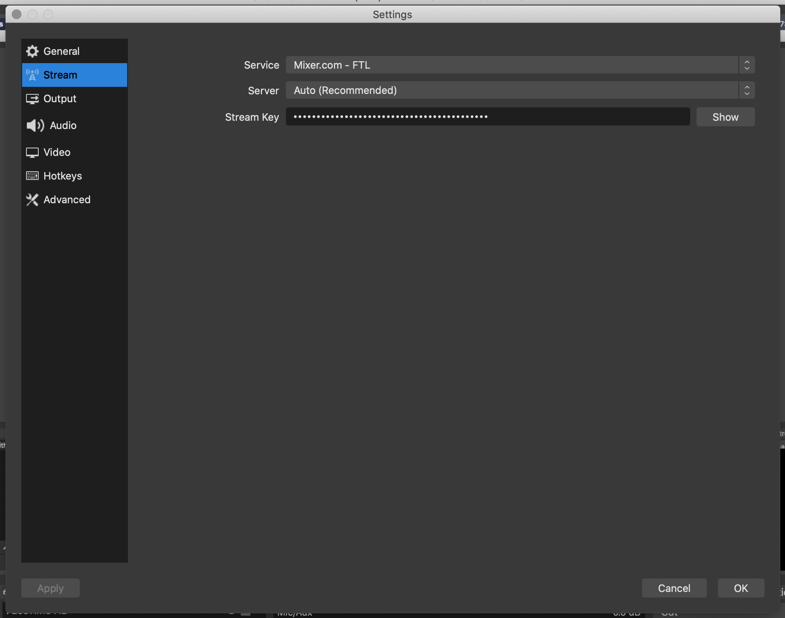
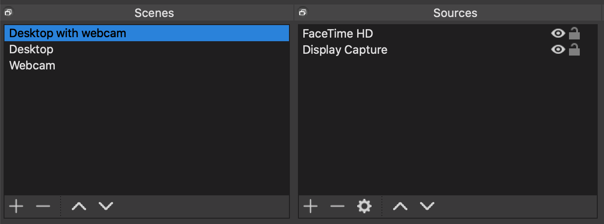
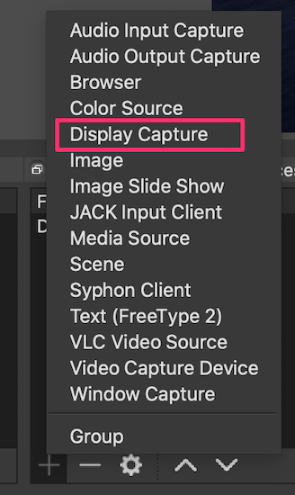
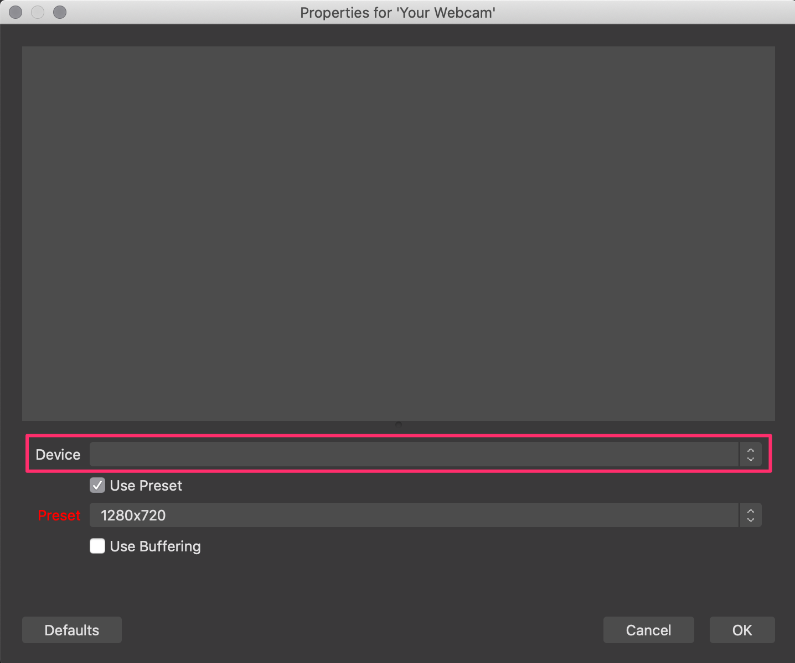
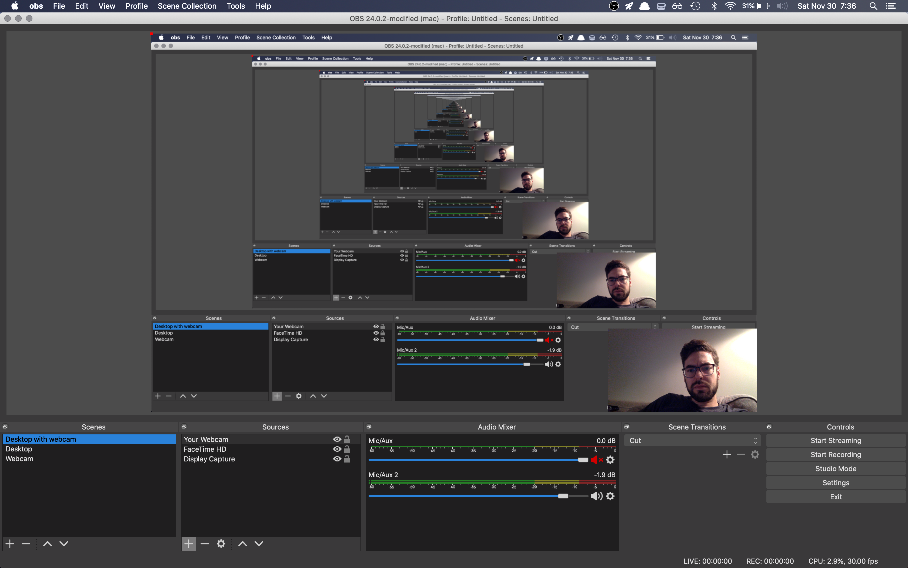
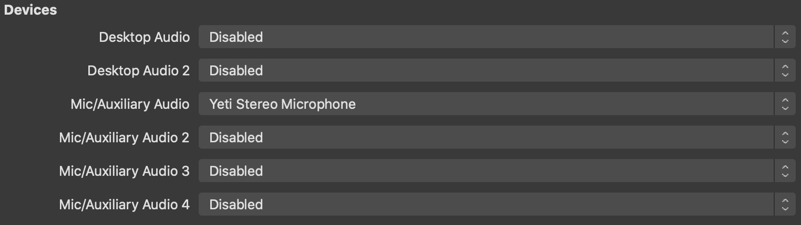
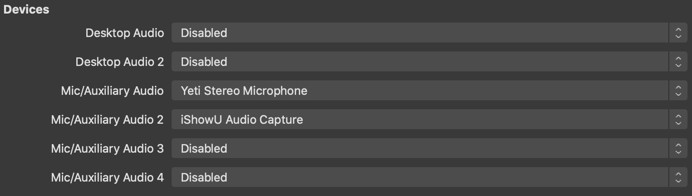

I just started live streaming. I’ve done it exactly twice.

I wasn’t sure what to expect before I started and, at times, didn’t even know where to start.

But now that I’m [up and running on Mixer](https://mixer.com/ryanharris), I have found it to be an awesome experience. It gives me a great excuse to play around with new technologies and it’s been fun learning alongside the supportive streamer community.

At first, I didn’t know what was required to get a streaming setup together, but I was pretty sure I didn’t have it. After some research (and chats with helpful friends), I soon realized it was possible even with [my minimal setup](https://ryanharris.dev/uses/). This played a huge part in getting me over the initial hurdle of feeling “ready” to stream. And while I don’t always feel ready today, having a good setup has at least made me feel more comfortable.

Hopefully, this guide will help you feel the same!

### 1. Download OBS

OBS (Open Broadcaster Software) is an open source software project for live streaming. Essentially, it works like a TV switcher and allows you to control your video inputs, audio levels and output resolution (among many other things) before sending the feed to your preferred streaming service.

### Stop!

If you aren’t running macOS Catalina yet, I would suggest holding off on clicking that “Update” button. OBS and Catalina don’t play nice together, which has been well documented in their user forums. TL;DR to run OBS on Catalina you have to do it from the command line.

For example, in my Applications folder I have to run the following command:

```
OBS.app/Contents/MacOS/OBS
```

[OBS (Open Broadcaster Software)](https://obsproject.com/) is an open source software project for live streaming. Essentially, it works like a TV switcher and allows you to control your video inputs, audio levels and output resolution before sending the feed to your preferred streaming service.

After downloading and installing the app, open the OBS preferences and go to the Stream tab. Here, choose your streaming service and enter your stream key, which you can find in your Mixer (or Twitch) account settings.



And voila! You’re done.

No, really. If you wanted to, you could just push the “Start Streaming” button and do just that. I wouldn’t recommend it… but you could.

Before going live, lets properly set up our video and audio inputs.

### 2. Setup Video Inputs

Of the two input types, I would say the video setup is more straightforward than its audio counterpart.

As you saw above, I’m not working with much equipment, so I only capture two visual elements right now:

1. My desktop
2. MacBook Pro webcam

Currently, I have my inputs set up in multiple Scenes (which I’ll be writing about in the future), but you can clearly see the two items above in the Source panel for my first scene.



Configuring OBS to capture my screen was relatively straightforward. Just click the plus sign and choose Display Capture:



You should now see an Inception like view of your desktop within the OBS broadcast window. In here, you can manipulate all your video imports and do things like:

1. Resize elements
2. Reposition elements
3. Apply video filters

To add my webcam (labeled FaceTime HD), I had to add a Video Capture device from the same menu. When prompted, choose to create a new capture device and give it an appropriate name:


On the next screen, choose your input device from the dropdown.



Now, you should see yourself in the broadcast window. Resize and reposition the webcam input to your liking. Currently, I have my webcam feed as a picture-in-picture in the bottom right hand corner of my screen. It looks like this:



### 3. Configure audio

Since I’m streaming on a Mac, this is definitely the hardest part. From what I’ve been told, if you have the option to stream on a PC, do that instead.

The first thing we’ll do is plug in our USB microphone (I use a Blue Yeti) and set OBS to capture its audio:



While connecting devices like my mic can be pretty simple, [macOS makes it very difficult](https://lofi-gaming.org.uk/blog/2016/09/17/capture-mac-desktop-audio-obs/) to capture desktop audio.

To do this, we’ll need to use another app called iShowU Audio Capture. Follow the installation steps on their website, restart your computer and then open your macOS Sound preferences.

You should now see an additional device labeled iShowU Audio Capture. Set this as both your active Input and Output.

Back in OBS, we’ll also need to add this as an audio input just like we did with the mic. Once you do, test it’s hooked up correctly by playing some music and checking the VU meter in OBS’ audio panel.



### 4. Press the Stream button!

That’s it! You’re all set up and ready to go.

Of course, there are lots of things we didn’t cover here in terms of OBS configurations and creative options. In upcoming articles, I will cover additional topics like what Scenes are and how to manage them, as well as how to add music to your stream.

Now, go press that button!
