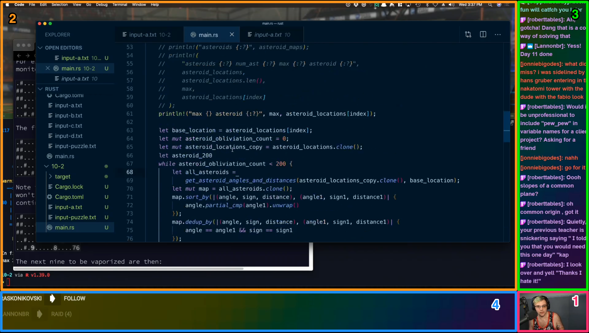

### What are Scenes?

[Like I’ve said in the past](https://ryanharris.dev/2019-11-30-going-live-with-obs/), I like to think of OBS as a TV switcher because it allows you control Scenes as if they’re camera shots. But what exactly is a Scene?

Scenes are OBS canvases comprised of one (or more) visual elements, all of which can be resized, repositioned or affected with filters. While it’s not necessary to have multiple Scenes in order to start streaming, doing so can certainly help add production value.

Before we continue, let’s momentarily take a step back and talk a little more about what makes up a Scene by looking at an example. Below is a screenshot of the primary Scene from [Chris Biscardi’s Twitch stream](https://www.twitch.tv/chrisbiscardi). Again, while this is only one canvas, it is made up of multiple elements. Can you identify them all?

This example illustrates how much you can do within a given Scene really well. From what I can tell, Chris has at least five elements in the Scene:

1. Webcam showing Chris
2. Desktop capture
3. Twitch chat pane
4. Twitch follow/subscription activity
5. Rainbow gradient background image (unlabeled)

Currently, my own setup is a bit more basic, but more suitable for my needs. As I continue to build out my streaming rig, I will most likely have to change how I produce my stream. Could make an interesting post in the future!

### My current Scenes

> NOTE: If you’re new to streaming, I suggest you check out this article by Suz Hinton before proceeding as it was where I started when configuring my own Scenes 🚀

Right now, I have three separate Scenes configured:

1. Webcam
2. Desktop
3. Desktop with webcam

#### 1. Webcam

This was the simplest to set up. Currently, it directly captures the camera on my MacBook Pro and takes up 100% of the OBS broadcast canvas.

I use this primarily when interacting with users in the chat or when there’s a discussion that doesn’t require looking directly at code. In the future, I will swap out the webcam in favor of a DSLR in order to improve the visual quality of this Scene.

#### 2. Desktop

In my case, this scene is a direct capture of a MacBook Pro screen, which like the Webcam, takes up 100% of the canvas in its given Scene. Once I hook up the new monitor I bought over Black Friday, I’ll be able to choose which display I want to capture.

This will come in handy when working with sensitive information because I can simply move those windows to the non-capture display and hide it from viewers. This is a great strategy if you’re working with API keys, environment variables, etc.

Technically, you could also achieve this same effect by cropping the desktop capture element in your OBS broadcast window. In doing this, you limit what parts of your display users can see, allowing you to keep sensitive information outside of the capture area.

While I prefer the former, I will most likely end up cropping my stream output when I hook up my new monitor since I’ll be using it as my primary (and only monitor). To clear space on my desk, I also like to keep my closed laptop and off to the side.

#### 3. Desktop with webcam

Up until now, all of the Scenes have only had one visual element within them. This one has two.

Essentially, this Scene combines the two previous ones. Taking advantage of OBS’ resizing/repositioning capabilities, I shrank the input from my Webcam and positioned it in the bottom right hand corner of my screen (on top of the Desktop) to achieve a picture-in-picture effect.

I use this as my primary Scene because it allows viewers to see me and the code at the same time, which makes it easier to converse while coding. E-sports gamers often use this setup too (in conjunction with a green screen) to achieve that “floating head in the corner” effect.

### Improvements to Make

#### 1. Standby scene

This is another idea I found in Suz’s article. Basically, when you start your stream, there is a bit of a delay. During that time, you may want to tweet or drop a stream link in your favorite Discord chat before you get going.

For example, I usually like to check my [Mixer channel](mixer.com/ryanharris/) before I start in order to make the broadcast is working, but I don’t really want the viewers to see me doing that (he’s so vain!). This scene would allow me to do that by simply displaying a graphic instead of my desktop.

#### 2. Lower third for webcam

You’ve seen this before (even if you didn’t know it).

It’s a pretty common effect used in TV, especially news, to inform the viewer as to who is currently speaking on camera. This would work great in my Webcam Scene for when the viewer is thinking, “Who the heck is this guy?”

Again, while this isn’t necessary, it could add a little production value that helps my stream stand out. With the help of a designer, this could also be a good opportunity for visual branding too. (If you know of any, send ‘em my way!)

### Beyond Scenes

If we continue with the analogy of OBS being a TV switch in software form, there are also hardware counterparts to go alongside it. Popular tools like [Elgato’s Stream Deck](https://www.elgato.com/en) let’s you (amongst many other cool things) switch scenes on the fly without having to use the OBS interface.

If you’re like me and aren’t at that point yet, you can also achieve this by setting up OBS hotkeys. Since I only have three basic scenes, that will suffice for now, but won’t scale once I get beyond a certain point of complexity.
