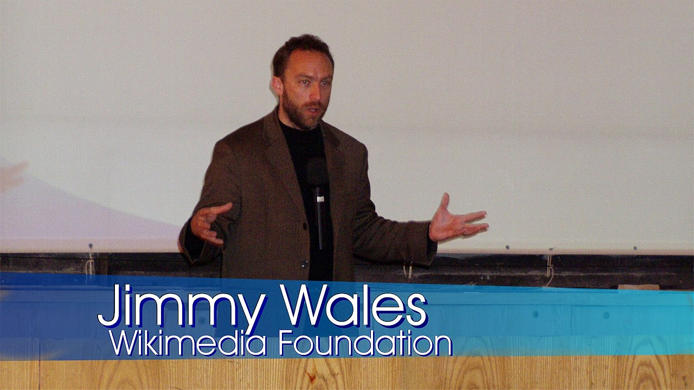

### What are Scenes?

[Like I’ve said in the past](https://ryanharris.dev/2019-11-30-going-live-with-obs/), I like to think of OBS as a TV switcher because it allows you control Scenes as if they’re camera shots. But what exactly is a Scene?

Scenes are OBS canvases comprised of one (or more) visual elements, all of which can be resized, repositioned or affected with filters. While it’s not necessary to have multiple Scenes in order to start streaming, doing so can certainly help add production value.

Before we continue, let’s take a step back and talk a little more about what makes up a Scene by looking at a less-than-trivial example:

Below is a screenshot of the primary Scene from [Chris Biscardi’s Twitch stream](https://www.twitch.tv/chrisbiscardi). While you can see there is only one canvas, the Scene is, in fact, made up of multiple elements. Can you identify them all?

This example illustrates how much you can do within a given Scene really well. From what I can tell, Chris has at least five elements in this Scene:

1. A webcam showing Chris (wearing his trademark tanktop)
2. Chris' desktop, so you can see what he's working on
3. A pane with his Twitch channel's chat
4. Another pane with Twitch events like follows, subscribes, etc.
5. A rainbow gradient background image (unlabeled)

### My current Scenes

> NOTE: If you’re new to streaming, I suggest you check out [this article by Suz Hinton](https://medium.com/@suzhinton/my-twitch-live-coding-setup-b2516672fb21) before proceeding as it was where I started when configuring my own Scenes 🚀

Right now my own setup is a bit more basic, but gets the job done. Currently, I have three separate Scenes configured in OBS:

1. A webcam
2. A desktop capture so viewers can see my workspace
3. A combined view with both Scenes #1 and #2 on screen

#### 1. Webcam

This was the simplest to set up. Currently, it directly captures the camera on my MacBook Pro and takes up 100% of the OBS broadcast canvas.

I use this primarily when interacting with users in the chat or when there’s a discussion that doesn’t require looking directly at code. In the future, I will swap out the webcam in favor of a DSLR in order to improve the visual quality of this Scene.

#### 2. Desktop

In my case, this Scene is a direct capture of my MacBook Pro screen, which like the previous Scene, takes up 100% of the canvas. Once I hook up the [new monitor I bought over Black Friday](https://www.amazon.com/LG-32GK650F-B-Monitor-FreeSync-Technology/dp/B07FLGR2PN), I’ll be able to choose which display I want to capture.

This will come in handy when working with sensitive information because I can simply move those windows to the non-capture display and hide it from viewers. This is a great strategy if you’re working with API keys, environment variables, etc.

Technically, you could also achieve this same effect by cropping the desktop capture element in your OBS broadcast window. In doing so, you limit what parts of your display users can see, allowing you to keep sensitive information on-screen but outside of the capture area.

While I prefer the former, I will most likely end up cropping my stream output with my new monitor since I’ll be using it as my only display (with my laptop closed and off to the side).

#### 3. Desktop with webcam

Up until now, all of my Scenes have only had one visual element within them, look alive cause this one has two!

Essentially, this Scene combines the two previous ones. Taking advantage of OBS’ resizing/repositioning capabilities, I shrank the input from my Webcam and positioned it in the bottom right hand corner of my screen (on top of the Desktop) to achieve a picture-in-picture effect.

I use this as my primary Scene because it allows viewers to see me and the code at the same time, which makes it easier to converse while working. E-sports gamers often use this setup too (in conjunction with a green screen) to achieve that “floating head in the corner” effect.

### Improvements to Make

Even though I'm still getting my streaming legs under me and building out my kit, that doesn't mean there aren't some things I can do right now to polish the visual aspect of my broadcasts.

#### 1. Standby scene

This is another idea I found in Suz’s article. Basically, when you start your stream, there is a bit of a delay before the broadcast is "live". During that time, you may want to tweet (or drop a stream link in your favorite Discord server) before you get going.

For example, I usually like to check my [Mixer channel](https://mixer.com/ryanharris/) before I start in order to make the broadcast is working, however, I don’t really want viewers to see that (he’s so vain!). This Scene would allow me to check the stream and the viewer would be none the wiser.

#### 2. Lower third for webcam

You’ve seen this before (even if you didn’t know it).

It’s a pretty common effect used in TV, especially news, to inform the viewer as to who is currently speaking on camera. This would work great in my Webcam Scene for when the viewer is thinking, “Who the heck is this guy?”

Again, while this isn’t necessary, it could add a little production value that helps my stream stand out. With the help of a designer, this could also be a good opportunity for visual branding too. (If you know of any, send ‘em my way!)

#### 3. Hardware for scene switching

While OBS is like a TV switcher in software form, there are also hardware counterparts that would alongside it in order to make Scene management easier. Popular tools like [Elgato’s Stream Deck](https://www.elgato.com/en) let you (amongst many other cool things) switch Scenes on the fly without having to use the OBS interface. This makes life easier for the streamer and results in a more seamless experience for the viewer.

Of course, if you’re like me and aren’t at that point yet, you can also achieve this by setting up hotkeys in OBS. Since I only have three basic Scenes right now, hotkeys will suffice, but once my setup reaches a certain point of complexity I'll need to bring in some hardware to help OBS out.

### Get Going

Scenes in OBS really are what you make of them. And while they can help give your stream the feeling of a higher production value, they do not replace quality content, nor do you need to make them too complicated. Hopefully, the information above is enough to get you started building out some basic Scenes, but where you take them in the long run is up to you!

Happy streaming 🚀
