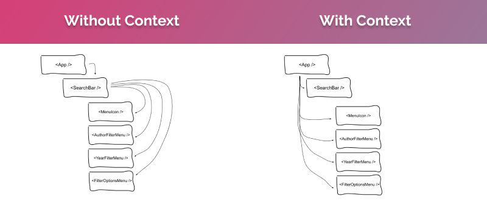

import { Link } from "gatsby"

### Putting things in Context

[Context is one of my favorite React APIs](https://reactjs.org/docs/context.html) and has a wide variety of uses cases. I've previously written about <Link to="2019-10-27-redoing-search">redoing a search UI using `ref`s and Context</Link>, as well as <Link to="/hooks-useref">how to use the `useRef` hook</Link>. This time around, we're going to cover the `useContext` hook, which is now the way we use Context in function components.

I love the Context API because it **allows you to compartmentalize aspects of your app's data within a sub-tree of components**. Essentially, you have a Provider (think of this as a gloabl value somewhat like a store), which provides access to its data via a `value` prop for child components. Those components can choose whether or not they want to consume the data (i.e. Consumers) at all, which means you can avoid [prop drilling](https://kentcdodds.com/blog/prop-drilling). Here's a rough illustration:



In `class` components, we used a combination of `<Context.Provider>` and `<Context.Consumer>` tags to set up the relationship described above. However, in function components, the `<Context.Cosumer>` syntax has been replaced with the `useContext` hook.

For context (no pun intended), the snippets below show these two implementations of the same Context. Despite the syntax difference, the functionality is **identical**.

```javascript
// TODO: Add code snippets
```

### Anatomy of useContext

The `useContext` hook takes one argument, a Context object, and provides access to the values from the nearest `Context.Provider` above it in the component tree. Any component consuming data from the `Provider` will **always** re-render any time one of the values changes.

```javascript
// TODO: Add code snippet
```

Notice that even though we're using the `useContext` hook, the way we define our context and `Provider` is exactly the same as our `class` example above. The provider works the same no matter which of the following consumption syntaxes you're using:

1. `useContext()`
2. `<Context.Consumer>`
3. [Class.contextType](https://reactjs.org/docs/context.html#classcontexttype)

### In practice

ADD CODESANDBOX DESCRIPTION

<iframe
  src="https://codesandbox.io/embed/charming-knuth-meepq?fontsize=14&hidenavigation=1&theme=dark"
  style="width:100%; height:500px; border:0; border-radius: 4px; overflow:hidden;"
  title="hooks/useContext"
  allow="geolocation; microphone; camera; midi; vr; accelerometer; gyroscope; payment; ambient-light-sensor; encrypted-media; usb"
  sandbox="allow-modals allow-forms allow-popups allow-scripts allow-same-origin"
></iframe>
