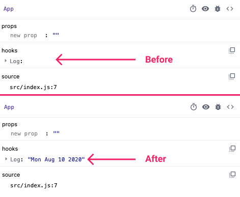
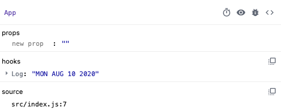

import { Link } from "gatsby"

### #TIL

I'll be honest: before working on this series, I had never heard of `useDebugValue` (or seen it in a codebase).

Unlike the hooks we've covered thus far, `useDebugValue` is not intended to add functionality to your applications. Instead, as the name suggests, it is used as a debugging tool and can help developers troubleshoot issues in their custom React hooks.

> We don’t recommend adding debug values to every custom Hook. It’s most valuable for custom Hooks that are part of shared libraries. ~ [React docs](https://reactjs.org/docs/hooks-reference.html#usedebugvalue)

Though it doesn't effect your application logic in anyway, this hook can negatively effect performance in certain cases if you're not careful (more on this later).

### Anatomy of useDebugValue

First things first, let's see what `useDebugValue` looks like in action:

<iframe src="https://codesandbox.io/embed/hooksusedebugvalue-ccnju?fontsize=14&hidenavigation=1&theme=dark&view=editor"
     style="width:100%; height:500px; border:0; border-radius: 4px; overflow:hidden;"
     title="hooks/useDebugValue"
     allow="accelerometer; ambient-light-sensor; camera; encrypted-media; geolocation; gyroscope; hid; microphone; midi; payment; usb; vr; xr-spatial-tracking"
     sandbox="allow-forms allow-modals allow-popups allow-presentation allow-same-origin allow-scripts"
   ></iframe>

In the snippet above, we've defined our own custom hook, `useDate` (more about these in an upcoming article). Currently, the hook fires once on `App`'s initial render -- due to the empty dependency array -- and displays it on the page.

Note that we're also using a `useDebugValue` hook within `useDate`, which takes a single value and then displays it in the [React DevTools](https://github.com/facebook/react-devtools). In the screenshot below, you can see how the snippet above would look in your browser.



### Formatting useDebugValue

`useDebugValue` also takes an optional second argument, which can be used to format the hook's display value. In this case, the function's signature would look like this:

```javascript
useDebugValue(date, date => date.toDateString().toUpperCase())
```

The hook works the same way it does without the second argument, however, it's output now looks like this:



### Notes about the formatting function

As I mentioned in the intro, while this hook does not effect how your application works, it can effect performance if the logic within the formatter function is expensive.

Luckily, the React team built in a safeguard for this and, [as it says in the documentation](https://reactjs.org/docs/hooks-reference.html#defer-formatting-debug-values), the function will only be executed when you are inspecting your hooks within the dev tools.

Though use-cases for a complex formatter function may be few and far between, be careful about the logic you house within it so as to avoid unintended performance issues.

### Real-world use case

Odds are you won't be using `useDebugValue` too much in your day to day work unless you're building custom hooks or an open source library.

Since custom hooks are built using the standard hooks provided by React, `useDebugValue` is primarily a nice solution to help you debug the internals of your hook implementation in the React Dev Tools pane, as opposed to adding `console.log()` calls everywhere.
