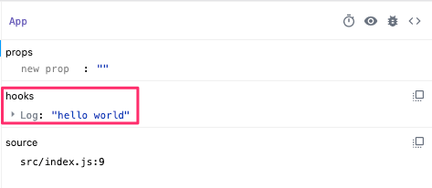
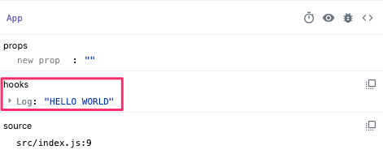

import { Link } from "gatsby"

### #TIL

I'll be honest: before working on this series, I had never heard of `useDebugValue` (or seen it in a codebase).

Unlike the hooks we've covered thus far, `useDebugValue` is not intended to add functionality to your applications. Instead, as the name suggests, it is used as a debugging tool and can help developers troubleshoot issues in their custom React hooks.

While it doesn't effect your application logic in anyway, this hook can negatively effect performance in certain cases if you're not careful. We'll talk more about this in a bit.

### Anatomy of useDebugValue

Here's what `useDebugValue` looks like in action:

```javascript
useDebugValue("hello world")
```

The hook takes a single value and then displays it in the [React DevTools](https://github.com/facebook/react-devtools). In the screenshot below, you can see how the snippet above would look in your browser.



`useDebugValue` also takes an optional second argument, which can be used to format the hook's display value. In this case, the function's signature would look like this:

```javascript
useDebugValue("hello world", value => value.toUpperCase())
```

The hook works the same way it does without the second argument, however, it's output now looks like this:



### Notes about the formatting function

As I mentioned in the intro, while this hook does not effect how your application works, it can effect performance if the logic within the formatter function is expensive.

Luckily, the React team built in a safeguard for this and, [as it says in the documentation](https://reactjs.org/docs/hooks-reference.html#defer-formatting-debug-values), the function will only be executed when you are inspecting your hooks within the dev tools.

Though use-cases for a complex formatter function may be few and far between, be careful about the logic you house within it so as to avoid unintended performance issues.
