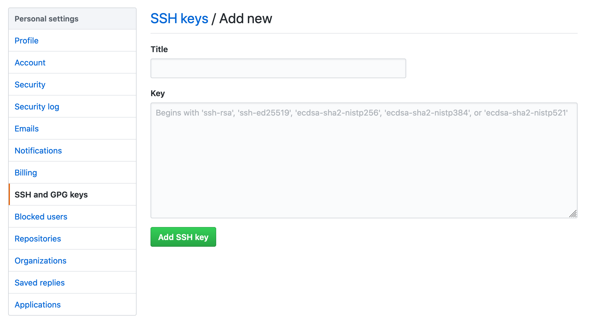

While setting up my development environment during the first few days of my new job at [Fauna](https://www.fauna.com), I was already faced with a new challenge: how to manage multiple git users and SSH keys on the same machine.

### Why have multiple users and keys?

For security reasons, our developers use company-specific GitHub accounts instead of granting access to our personal accounts. Since I use my computer for both work and fun side projects, I need to be able to maintain access to repos from both accounts, as well as storing the associated credentials. On top of that, I also needed to make sure my commits and PRs were associated with the proper user for each repo, respectively.

Below is a quick primer on how to configure your `git` users and SSH keys with the help of `ssh-agent 🙌

### Generating a SSH key

To get started, we will need to generate SSH keys locally and then link those credentials to our GitHub users.

First, open your terminal and run the following command (substuting your own email address):

```bash
ssh-keygen -t rsa -b 4096 -C "ryan@home.com"
```

_Note_: You will be prompted to choose a name for the key files generated by command, but by default the private key will be named `id_rsa` and the public key will be `id_rsa.pub`. Everytime the command is run, another pair will be generated.

Next, log into the account we are going to associate this key with. Go to the account settings and open the `SSH and GPG keys` section. Add a new SSH key and give it a clear name.



In the `<textfield>` below, we need to enter the public key generated by the command above. You can find this in a couple ways:
1. Copy the key from the `.pub` file in your `/.ssh/` directory
2. Run the following command `pbcopy < ~/.ssh/id_rsa.pub`

### Managing your SSH keys

Assuming we have multiple GitHub accounts, we would want to repeat the steps above for each. However, managing all these keys could quickly become unwieldy. This is where `ssh-agent` comes in!

From [their own documentation](https://www.ssh.com/ssh/agent), `ssh-agent` is a "...helper program that keeps track of user's identity keys and their passphrases." This is exactly what we need!

For each of the keys we've generated, we will want to run the following command to add it to the identities `ssh-agent` is managing:

```bash
# Personal account
ssh-add ~/.ssh/id_rsa

# Work account
ssh-add ~/.ssh/id_rsa_work
```

Then, confirm they've been added properly by running `ssh-add -l`, which will list all the identies `ssh-agent` is currently keeping track of.

### Setting up a SSH config file

Now that `ssh-agent` is properly keeping track of all our identities, we will need to configure it in order to associate them with the appropriate GitHub repos and user names. 

One way to do this is by cloning repos with an appended `-username`. For example, if I was cloning the repo for this site, I would usually do this:

```bash
git clone git@github.com:ryancharris/ryanharris-dot-dev.git
```

However, I can also append our username (ex. `-work`) onto the URL like so:

```bash
git clone git@github.com-work:ryancharris/ryanharris-dot-dev.git
```

Right now, this won't do much other than set the repo's `origin` to be the modified URL you entered. The real magic comes in when we create our SSH config. Let's create a blank file in `/.ssh/` by running the command below:

```bash
touch ~/.ssh/config
```

Then, we'll open the file and edit its contents to be something along these lines:

```bash
# Personal
Host github.com
   HostName github.com
   User git
   IdentityFile ~/.ssh/id_rsa
   
# Work
Host github.com-work    
   HostName github.com
   User git
   IdentityFile ~/.ssh/id_rsa_work
```

Now, whenever we `push` or `pull` from our GitHub repos using SSH, the config file will determine which identity and key to use based on the Host URL. Since cloning our repos with the `-user` name suffix, pre-configured their `git` remotes, we don't need to do anything to them. However, you will need to update the remote URLs in any repo that existed before you created this configuration.

### Updating git commiter info

By default, the `git` CLI will use your global config file to determine the username and address of the commiter unless you tell it otherwise. Since we have multiple GitHub accounts we're working with here, we will also need to make sure the commiter info is correct in our local repos so that it populates properly on GitHub.

First, confirm that you have a global `git` config by running:

```bash
git config --global -l
```

Confirm that the `user.name` and `user.email` fields in your config have values. If not, let's quickly add them using the email address we used to first generate our keys:

```bash
git config --global user.name "Ryan Harris"
git config --global user.email "ryan@home.com"
```

### Managing commiter info by repo

Since the global `git` config will now take precedence, any repo on your system associated with your default key/identity will already have the proper information applied when you make commits. Any repos you cloned using another identity will then have the incorrect commit info, so we'll need to update those repos to use local, repo-scoped config values.

To do this, navigate into one of these repos and update the committer information locally. Note the lack of a `--global` flag:

```bash
git config user.name "Ryan's Work Account"
git config user.email "ryan@work.com
```

To test that this all worked, you can either clone a repo or test the SSH connection via the terminal:

```bash
# Personal account
ssh -T git@github.com

# Work account
ssh -T git@github.com-work
```

### Done! 😅

As long as you're using the proper GitHub URLs and configured your `git` config locally, your commits to GitHub should:
1. Authenticate with the proper key/identity
2. Have the proper `git` commit information

While this take a bit of configuration, it is most certainly better than managing these manually on a daily basis. Happy tunneling!