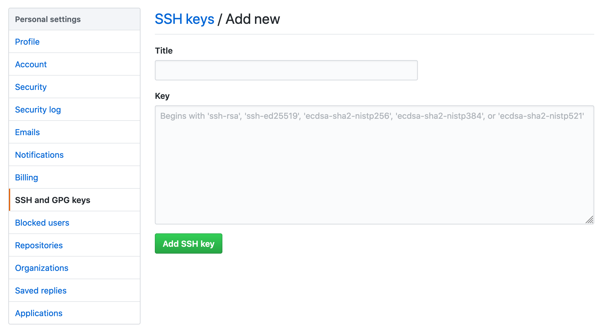

During the onboarding process for my new job at [Fauna](https://www.fauna.com), I was tasked with setting up my local development environment. However, since Fauna devs use work-specific GitHub accounts, a new challenge presented itself during the process: managing SSH keys and identities for multiple accounts.

### Multiple accounts and keys

In the past, I have always used my personal account for all my projects, both personal and professional. Since our security policy does not allow for that, I needed to configure my system to work with both my personal and work accounts by doing the following:

1. Create two SSH keys/identities and manage them locally using **ssh-agent**
2. Create a SSH config to determine which credentials to use when authenticating with GitHub
3. Update **git** config so our commiter information is accurate in each repo

What follows is a quick primer on how to set all this up and avoid doing it manually 🙌.

### Generating a SSH key

To get started, we will need to generate SSH keys for each of the GitHub accounts we will be working with. In my case, there will be two: a work account and a personal account.

First, open your terminal and run the following commands (substituting your own email address):

```bash
# Personal
ssh-keygen -t rsa -b 4096 -C "ryan@ryanharris.dev"

# Work
ssh-keygen -t rsa -b 4096 -C "ryan@fauna.com"
```

You will be prompted each time to choose a name for the public/private key pairs this command generates. By default, the name will be **id_rsa** and **id_rsa.pub**, respectively. To make things more clear, we will use the names **id_rsa_personal** and **id_rsa_work**.

```bash
# Personal
➜ ssh-keygen -t rsa -b 4096 -C "ryan@ryanharris.dev"
Generating public/private rsa key pair.
Enter file in which to save the key (/Users/ryan/.ssh/id_rsa): id_rsa_personal

# Work
➜ ssh-keygen -t rsa -b 4096 -C "ryan@fauna.com"
Generating public/private rsa key pair.
Enter file in which to save the key (/Users/ryan/.ssh/id_rsa): id_rsa_work
```

Next, we'll need to log into both GitHub accounts and add the new SSH key. Go into account settings and open the SSH and GPG keys sections. Then, add a new SSH key:



In the <textfield> below, we need to enter the public key we generated above. You can do this in a couple ways:

1. Copy the key from the **.pub** file in your **/.ssh/** directory
2. Run the following command `pbcopy < ~/.ssh/id_rsa.pub`

### Managing your SSH keys

With our GitHub accounts squared away, we now need to manage the keys on our local system using a CLI tool called **ssh-agent**. As described in [their own documentation](https://www.ssh.com/ssh/agent), **ssh-agent** is a "...helper program that keeps track of user's identity keys and their passphrases", which is exactly what we need!

Let's add each of the keys we've generated to **ssh-agent** by running the command below for both:

```bash
# Personal
ssh-add ~/.ssh/id_rsa_personal

# Work
ssh-add ~/.ssh/id_rsa_work
```

To confirm they've been properly added, run `ssh-add -l`, which will list out all the identities **ssh-agent** is currently managing.

### Setting up a SSH config file

With **ssh-agent** now keeping track of the keys for our work and personal accounts, we need to create a local SSH config so our system knows which key to use when pushing to or pulling from GitHub.

To do this, whenever we clone a repo, we can append a **-username** to the repo URL in order to indicate which account it's associated with. For example, if I was cloning the repo for this site, I would normally do this:

```bash
git clone git@github.com:ryancharris/ryanharris-dot-dev.git
```

However, I can also append our usernames (i.e. -personal or -work) onto the URL like so and the repo will still clone properly:

```bash
# Personal
git clone git@github.com-personal:ryancharris/ryanharris-dot-dev.git

# Work
git clone git@github.com-work:ryancharris/ryanharris-dot-dev.git
```

Right now, this won't do much other than set the repo's remote origin to be the modified URL you entered. The real magic comes in when we create our SSH config. Let's create a blank file in **/.ssh/** by running the command below:

```bash
touch ~/.ssh/config
```

Then, we'll open the file and edit its contents to be something along these lines:

```bash
# Personal
Host github.com-personal
   HostName github.com
   User git
   IdentityFile ~/.ssh/id_rsa_personal

# Work
Host github.com-work
   HostName github.com
   User git
   IdentityFile ~/.ssh/id_rsa_work
```

Now, whenever we ushor ullfrom GitHub, the proper key and identity will be used based upon this repo's remote rigin Since we cloned our repos using the altered URLs appended with our user name, they will automatically work.

Repos you cloned prior to having two SSH identities, however, will not work right away. Instead, you simply need to update their remote riginURL to use the usernamesuffix. Then, the SSH config will know which key to associate with the request.

### Updating git commiter info

Finally, we need to make sure that our commits are attributed to the right user since we'll be pushing to repos owned by multiple GitHub accounts. By default, the git CLI will use the information in your global config file.

First, let's confirm we have a global git configuration setup:

```bash
git config --global -l
```

If you do not have any values for user.name and/or user.email, let's quickly add them:

```bash
git config --global user.name "Ryan Harris"
git config --global user.email "ryan@ryanharris.dev"
```

When commiting code, git will populate committer info from the global config unless the repo has a local config present that overwrites it. Since we are working with two GitHub user accounts, we will want to update the committer info for any repo not associated with the account in the global config.

To do this, navigate into one of these repos and update the committer information locally. Note the lack of a --global flag:

```bash
git config user.name "Ryan at Work"
git config user.email "ryan@fauna.com"
```

### Done! 😅

To test that this all worked, you can either clone a repo or test the SSH connection via the terminal:

```bash
# Personal
ssh -T git@github.com-personal

# Work
ssh -T git@github.com-work
```

Now, you won't have to manage your keys manually when working with multiple accounts! Though this all takes a bit of configuration, it is not something you will have to do frequently. Just set it and forget it!
