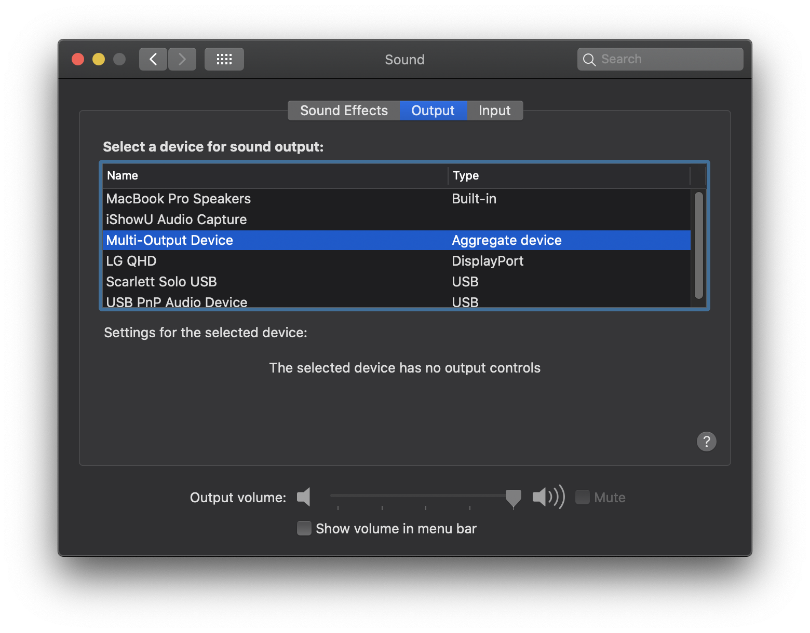
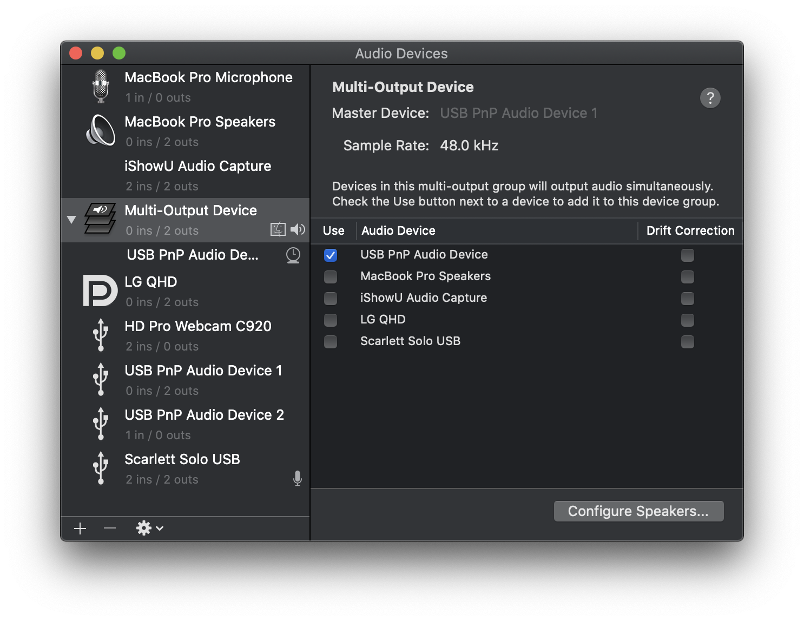
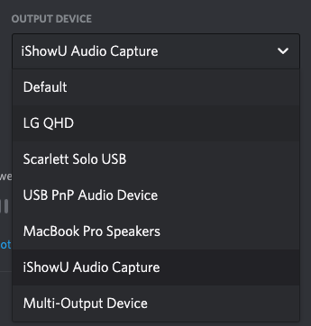
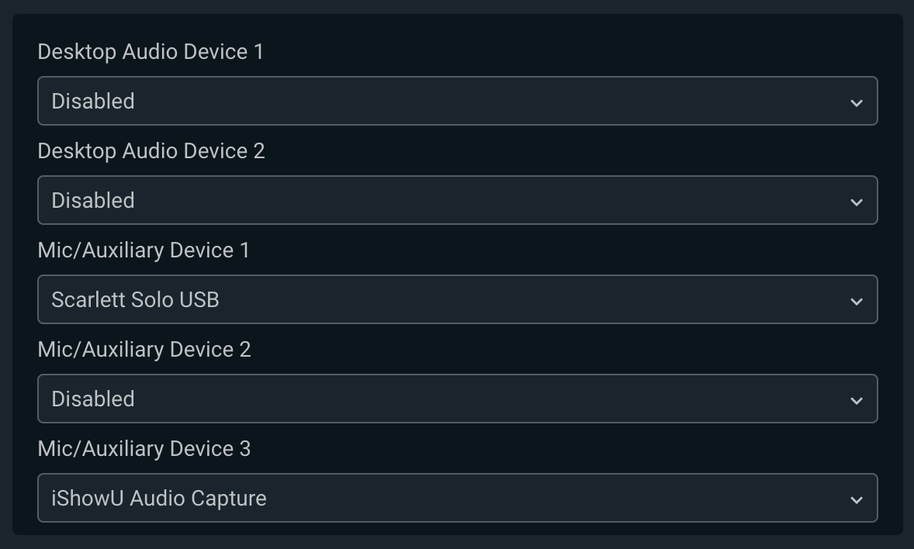

While I usually stream on [Twitch](https://twitch.tv/ryan_c_harris), I have recently been doing streams in [Reactadelphia's](https://www.meetup.com/Reactadelphia/) [Discord server](https://discord.gg/rTnVTp4). The idea of interacting with viewers via voice chat was quite appealing; however, the downside is that it lacks the visibility of Twitch -- folks not in your Discord server can't join in on the fun.

After chatting with [Kurt Kemple](https://theworst.dev) and [Trevor Blades](https://trevorblades.com) (coincidentally, using Discord's voice capabilities) during the recent [GraphQL Summit](https://summit.graphql.com/), I thought it be nice if we could mix the visibility of one service with the immediacy of the other.

The TL;DR of the solution I came up with was to pipe Discord's audio into my streaming software, along with my mic audio. Of course, my setup also had a self imposed complication -- I wanted to listen to Spotify while streaming, but not broadcast it since I do not have the rights.

It took some experimentation, but here's the general setup I landed on:

**Tools**

- Macbook Pro (2019)
- [Streamlabs OBS](https://streamlabs.com/) (stream software)
- [iShowU Audio](https://support.shinywhitebox.com/hc/en-us/articles/204161459-Installing-iShowU-Audio-Capture-Mojave-and-earlier-) (desktop audio capture)
- USB-C hub w/ headphone jack

**Configuration**

Since I want to split Spotfiy and Discord audio up, I can't simply use iShowU to capture and output all my audio wholesale. To do this, I had to:

1. Set the macOS Sound preferences to out put to Multi-Output Device. You can create this in the Audio MIDI Setup app.

2. In the aforementioned app, select the headphones (USB PnP Audio Device). All desktop audio now plays in the headphones.

3. Change the Discord audio preference to output to iShowU Audio Capture. You will no longer hear Discord audio in your headphones.

4. In Streamlabs OBS, add your microphone and the iShowU audio as inputs (see below)

Now, you'll only receive the two audio signals you want in Streamlabs (mic and desktop) while still being able to listen to copyrighted on Spotify without risking its transmission.
